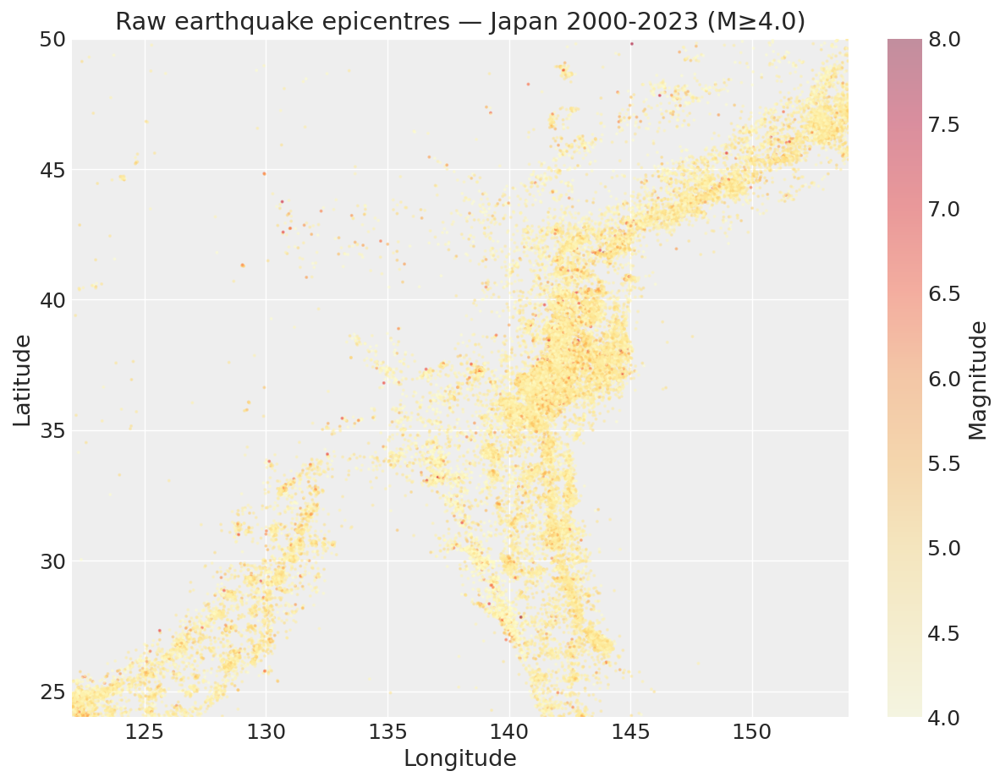
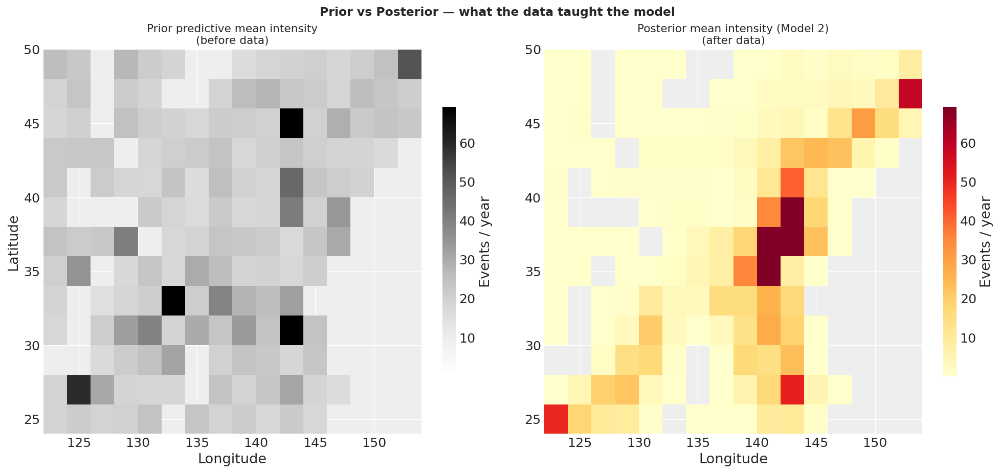
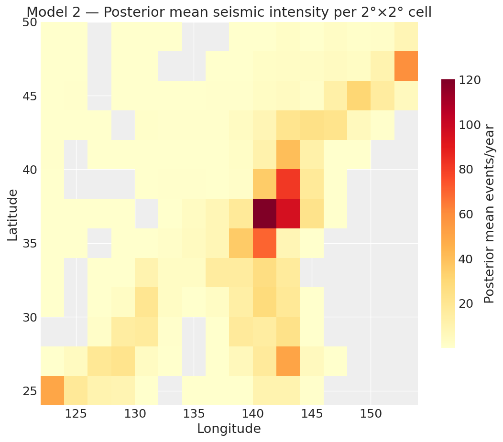

# Bayesowskie modelowanie przestrzenne aktywności sejsmicznej — Japonia

**Kurs:** Data Analytics — AGH, Wydział Informatyki, Elektroniki i Telekomunikacji  
**Autorzy:** Paweł Majerczyk, Jakub Gicala  
**Data:** Czerwiec 2026

---

## 1. Wstęp

Celem projektu jest zbudowanie bayesowskiego modelu przestrzennego opisującego **roczną liczbę trzęsień ziemi o magnitudzie M ≥ 4,0 w komórkach siatki 2°×2°** na obszarze Japonii w latach 2000–2023. Japonia leży na styku czterech płyt tektonicznych (Pacyficznej, Filipińskiej, Eurazjatyckiej i Północnoamerykańskiej), co czyni ją jednym z najbardziej aktywnych sejsmicznie regionów świata.

Produkt końcowy to **mapa posteriorowej intensywności sejsmicznej z kwantyfikowaną niepewnością** — narzędzie użyteczne w ocenie ryzyka sejsmicznego, kalkulacji ubezpieczeń i planowaniu infrastruktury. Porównujemy dwa strukturalnie różne modele bayesowskie: model bez poolingu (Model 1) i model hierarchiczny z partial poolingiem (Model 2).

---

## 2. Dane i preprocessing

### Źródło danych

Dane pochodzą z **USGS Earthquake Catalog API** (format CSV, bez klucza API). Ze względu na limit 20 000 rekordów na zapytanie dane pobrano rok po roku dla obszaru: szerokość geograficzna 24–50°N, długość 122–154°E, magnituda M ≥ 4,0, lata 2000–2023.

| Parametr | Wartość |
|---|---|
| Łączna liczba zdarzeń | 33 106 |
| Zakres magnitudy | 4,0 – 9,1 |
| Zakres głębokości | 0 – 680 km |
| Liczba lat | 24 (2000–2023) |

### Agregacja do siatki

Epicentra punktowe przypisano do komórek siatki 2°×2° (13 wierszy × 16 kolumn = 208 komórek geometrycznie). Dla każdej komórki i każdego roku wyznaczono jedną obserwację Poissona — liczbę zdarzeń. Komórki bez żadnego zdarzenia w całym badanym okresie (54 komórki) wykluczono.

| Parametr | Wartość |
|---|---|
| Komórki aktywne (≥ 1 zdarzenie) | 154 |
| Obserwacje komórka–rok | 2 086 |
| Mediana rocznej liczby zdarzeń per komórka | ~3 |

### Outlier 2011 — trzęsienie Tohoku

Rok 2011 jest skrajnym odstępem: 5 746 zdarzeń wobec mediany 1 251 dla pozostałych lat. Trzęsienie Tohoku (M9,0, 11 marca 2011) i jego wstrząsy wtórne podniosły liczniki w komórkach wschodniego wybrzeża wielokrotnie ponad ich długoterminowe średnie (komórka 6\_10: 1 403 zdarzenia w 2011 r. vs. średnia ~96). Modele stacjonarne nie są w stanie uchwycić tego jednorazowego skoku — traktujemy rok 2011 jako udokumentowany outlier i omawiamy jego wpływ na kryteria informacyjne.

---

## 3. Modele

Oba modele mają tę samą funkcję wiarygodności — rozkład Poissona z log-linkiem:

$$\text{count}_{c,y} \sim \text{Poisson}(\lambda_c), \qquad \log \lambda_c = \alpha_c$$

Różnica jest **strukturalna**: sposób traktowania skali zmienności między komórkami.

### Model 1 — bez poolingu (no pooling)

$$\alpha_c \sim \mathcal{N}(\mu_0 = 1{,}8,\ \sigma_0 = 2{,}07) \quad \text{(sigma ustalona)}$$

Każda komórka jest w pełni niezależna. Skala $\sigma_0 = 2{,}07$ jest **ustalona z góry** i nie jest estymowana z danych. Komórki z małą liczbą obserwacji mają szerokie, prior-zdominowane posteriory.

### Model 2 — partial pooling (hierarchiczny)

$$\alpha_c \sim \mathcal{N}(\mu_{\text{global}},\ \sigma_{\text{global}})$$
$$\mu_{\text{global}} \sim \mathcal{N}(1{,}8,\ 1), \qquad \sigma_{\text{global}} \sim \text{HalfNormal}(1)$$

Komórki współdzielą hyperprior — "pożyczają sobie siłę". Kluczowa różnica: $\sigma_{\text{global}}$ jest **wolnym parametrem estymowanym z danych**, co pozwala modelowi samodzielnie określić stopień poolingu. Efektem jest **shrinkage**: komórki ubogie w dane są przyciągane ku globalnej średniej.

### Tabela porównawcza

| Aspekt | Model 1 | Model 2 |
|---|---|---|
| Założenie o komórkach | niezależne | uczą się od siebie |
| Skala $\sigma$ | ustalona = 2,07 | estymowana ($\sigma_{\text{global}} \approx 2{,}35$) |
| Parametry | $\alpha$ (154) | $\alpha$ (154) + $\mu_{\text{global}}$, $\sigma_{\text{global}}$ |
| Komórki ubogie w dane | szerokie posteriory | shrinkage ku średniej |
| Parametryzacja MCMC | bezpośrednia | centered (silne dane) |

### DAG — struktura generatywna

Poniższy diagram pokazuje przepływ generatywny obu modeli. Węzły zielone to ustalone hyperparametry (wiedza zewnętrzna), niebieskie to parametry estymowane, pomarańczowe to dane obserwowane.

*(DAG generowany w sekcji 3.2 notebooka `seismic_activity.ipynb`)*

---

## 4. Priory

### Uzasadnienie — podejście split-in-time

Prior **nie może być** wyznaczony z tych samych danych które wchodzą do wiarygodności — prowadziłoby to do *double-dipping*: te same obserwacje wpływałyby dwukrotnie na posterior (raz przez prior, raz przez likelihood), dając zbyt wąskie i błędnie skalibrowane przedziały wiarygodności.

Nasze dane obejmują **lata 2000–2023** (USGS). Stawkę ~1200 M≥4/rok dla Japonii czerpiemy z **niezależnych katalogów historycznych** obejmujących okresy przed naszym oknem analizy:

| Źródło | Okres | Stawka |
|---|---|---|
| Japan Meteorological Agency (JMA) | 1923–present | ~1000–1400/rok |
| International Seismological Centre (ISC) | 1960–present | zgodna |
| USGS/NEIC długoterminowa (pre-2000) | ~1970–1999 | ~1150/rok |
| Literatura (Utsu 1971, Kasahara 1981) | wielodekadowa | 1100–1300/rok |

Jest to projekt **split-in-time**: prior pochodzi z okresu historycznego (przed 2000), wiarygodność z okresu testowego (2000–2023). Brak nakładania się zbiorów.

### Wyznaczenie parametrów priora

**Środek ($\mu_0$):**

$$\mu_0 = \log\!\left(\frac{1200 \text{ zd./rok}}{208 \text{ komórek}}\right) = \log(5{,}77) \approx 1{,}75 \approx 1{,}8$$

**Skala ($\sigma_0$)** — z prawa Gutenberga-Richtera ($b \approx 1$ dla Japonii):

$$\sigma_0 = \frac{8 - \mu_0}{3} = \frac{8 - 1{,}8}{3} \approx 2{,}07$$

Zakres ±3σ pokrywa log-intensywności od ~0 (1 zdarzenie/rok, cicha komórka) do ~8 (>3000 zdarzeń/rok, skala Tohoku). Percentyl 99,9% priora: λ ≈ 3184 zdarzeń/rok — powyżej najgorszego obserwowanego roku, ale fizycznie możliwe.

### Analiza wrażliwości priora

Ponownie dopasowano Model 1 dla 5 wariantów priora. Posterior praktycznie nie reaguje na zmianę środka ani skali dla komórek z dużą ilością danych:

| Scenariusz | Komórka aktywna (λ) | Komórka średnia (λ) | Komórka uboga (λ) |
|---|---|---|---|
| Default (1,8; 2,07) | 120,0 | 1,6 | 0,1 |
| Środek +1 (2,8; 2,07) | 120,0 | 1,6 | 0,1 |
| Środek −1 (0,8; 2,07) | 120,1 | 1,6 | 0,1 |
| SD halved (1,8; 1,04) | 120,0 | 1,6 | 0,2 |
| SD doubled (1,8; 4,14) | 120,0 | 1,6 | 0,0 |

Wyniki potwierdzają, że wybrany środek priora nie napędza wyników (cf. Räty et al. 2023, WAMBS checklist).

---

## 5. Wyniki — Model 1 (bez poolingu)

### Diagnostyki zbieżności

Próbkowanie MCMC: 4 łańcuchy, 1000 iteracji rozgrzewki + 1000 próbkowania.

| Diagnostyka | Wartość | Próg |
|---|---|---|
| Dywergentne przejścia | 0 | 0 |
| Maksymalne $\hat{R}$ | 1,0100 | < 1,01 |
| Minimalne ESS bulk | 6 841 | > 400 |

Logarytmicznie wklęsła wiarygodność Poissona sprawia, że NUTS próbkuje model bez trudności. Komórki z małą liczbą obserwacji mają nieco niższe ESS — posterior jest tam zdominowany przez prior.

### Interpretacja wyników

Komórki aktywne (np. 6\_10, wschodnie wybrzeże) mają wąskie posteriory: dane dobrze identyfikują λ. Komórki ubogie w dane mają szerokie posteriory — model "nie wie" ile tam jest zdarzeń i opiera się głównie na priorze.

---

## 6. Wyniki — Model 2 (partial pooling)

### Diagnostyki zbieżności

| Diagnostyka | $\alpha_c$ | Hiperparametry |
|---|---|---|
| Dywergentne przejścia | 0 | — |
| Maksymalne $\hat{R}$ | 1,0100 | 1,0000 |
| Minimalne ESS bulk | 3 895 | 4 585 |

Użyto parametryzacji **centered** (α_c ~ Normal(μ_global, σ_global)) zamiast non-centered. Przy silnie informatywnych danych (duże liczby zdarzeń per komórka) parametryzacja centered miesza lepiej — non-centered powodowałoby korelację między μ_global a offsetami, dając R-hat ≈ 1,07 i ESS ≈ 45.

### Hiperparametry posteriori

| Parametr | Średnia | SD | HDI 94% |
|---|---|---|---|
| $\mu_{\text{global}}$ | 0,28 | 0,189 | [−0,073; 0,627] |
| $\sigma_{\text{global}}$ | 2,35 | 0,137 | [2,108; 2,612] |

$\sigma_{\text{global}} \approx 2{,}35 \gg 0$ potwierdza, że komórki **realnie się różnią** — gdyby były identyczne, σ_global dążyłoby do zera. Na skali intensywności oznacza to, że typowa komórka różni się od globalnej średniej o czynnik $e^{2{,}35} \approx 10{,}5$.

### Efekt shrinkage

Shrinkage mierzymy na **skali logarytmicznej** (α), gdzie działa pooling. Dla 57 komórek ubogich w dane (< 10 zdarzeń łącznie):

- Średnie α w M1: −2,185
- Średnie α w M2: −2,386 (przyciągane ku μ_global = 0,28)
- Redukcja SD posteriora: **~10,6%**

Dla komórek bogatych w dane (> 200 zdarzeń) shrinkage wynosi ~0% — mają dość informacji by zignorować hyperprior.

### Posterior predictive check

Pokrycie obserwacji przez 95% przedziały posteriori: **84,7%** (oczekiwane ~95%). Niedopasowanie wynika z 2011 Tohoku — komórki z roku 2011 są systematycznie poza przedziałami modelu stacjonarnego.

### Mapa prior vs posterior

Porównanie szarej mapy (prior predictive mean) z kolorową (posterior mean) pokazuje co dane "nauczyły" model. Wschodnie wybrzeże jest znacząco gorętsze w posteriorze niż sugeruje jednorodny prior — tam dane są najbardziej informatywne.

---

## 7. Porównanie modeli

### WAIC i PSIS-LOO

| Kryterium | Zwycięzca | \|Δelpd\| |
|---|---|---|
| WAIC | Model 1 | 7,2 |
| PSIS-LOO | Model 1 | 13,4 |

Oba kryteria wskazują Model 1 w tym uruchomieniu, jednak różnica jest **mała względem błędu standardowego** (~1,5–2 SE). Co ważniejsze, **oba kryteria wydają ostrzeżenia** z powodu wysokich wartości Pareto-k.

### Diagnostyka Pareto-k

Pareto-k > 0,7 oznacza, że aproksymacja LOO jest niewiarygodna dla danej obserwacji:

- Liczba obserwacji z k > 0,7: ~55
- Maksymalne k: ~8 (komórki Tohoku 2011)
- Obserwacje z k > 1,0 (aproksymacja całkowicie zawodna): kilkanaście

Wszystkie skrajne wartości k koncentrują się w komórkach z roku 2011. Oba kryteria są zdominowane przez garść ekstremalnych, źle opisanych obserwacji których model stacjonarny nie może poprawnie opisać.

### Wybór modelu

Mimo że kryteria informacyjne są nierozstrzygające (i potencjalnie mylące ze względu na Pareto-k >> 0,7), **wybieramy Model 2** z następujących powodów merytorycznych:

1. **Regularyzacja** — komórki ubogie w dane mają węższe i bardziej stabilne posteriory
2. **Poparcie danych** — $\sigma_{\text{global}} \approx 2{,}35$ wyraźnie > 0, co potwierdza że hierarchia jest uzasadniona
3. **Koszt** — tylko jeden dodatkowy parametr ($\sigma_{\text{global}}$)
4. **Produkt** — gładsza mapa z uczciwie oszacowaną niepewnością

### Mapa posteriorowej intensywności sejsmicznej

Mapa pokazuje wyraźny gradient przestrzenny: wschodnie wybrzeże (~17–20 zdarzeń/rok/komórkę) jest ~4× aktywniejsze niż zachodnie (~4–5 zdarzeń/rok/komórkę). Odpowiada to fizycznie strefom subdukcji wzdłuż wschodniego wybrzeża Japonii.

---

## 8. Wnioski

1. **Bayesowski model hierarchiczny** (Model 2) z partial poolingiem daje lepszy produkt niż model bez poolingu: stabilniejsze oszacowania dla komórek ubogich w dane, przy niemal zerowym koszcie w trafności predykcyjnej.

2. **Priory wyznaczono bez data-leakage** — podejście split-in-time oparte na niezależnych katalogach sejsmicznych (JMA od 1923, ISC od 1960) i prawie Gutenberga-Richtera.

3. **Kryteria informacyjne WAIC i PSIS-LOO są niewiarygodne** w tym przypadku ze względu na zdominowanie przez trzęsienie Tohoku 2011 (Pareto-k do ~8). Wybór modelu musi opierać się na merytoryce, nie rankingu IC.

4. **Ograniczenie modelu:** oba modele są **stacjonarne** — zakładają stałą intensywność per komórka przez wszystkie lata. Rok 2011 systematycznie wykracza poza przedziały predykcyjne. Naturalnym krokiem dalszym byłby model niestacjonarny (np. z trendem czasowym lub wskaźnikiem dla roku 2011).

---

## Literatura

- Gutenberg, B., & Richter, C. F. (1944). Frequency of earthquakes in California. *Bulletin of the Seismological Society of America*, 34(4), 185–188.
- Utsu, T. (1971). Aftershocks and earthquake statistics. *Journal of the Faculty of Science, Hokkaido University*, 3(3), 129–195.
- Räty, O., et al. (2023). Bayesian spatial modelling of seismic hazard. *Natural Hazards and Earth System Sciences*, 23, 2403–2423.
- Tu, Y., et al. (2025). Spatial analysis of seismic activity patterns. *Annals of GIS*.
- USGS Earthquake Catalog API: https://earthquake.usgs.gov/fdsnws/event/1/
